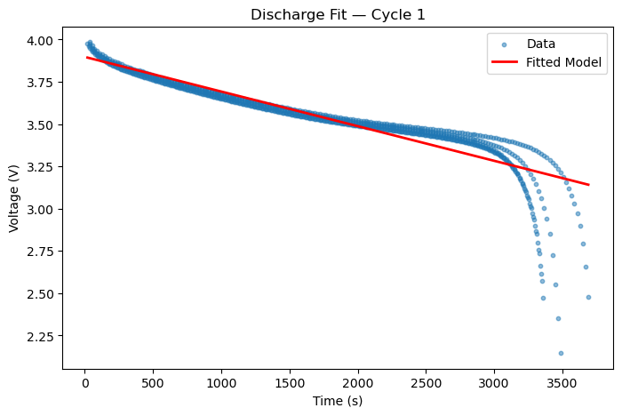

## Abstract

I analyzed NASA's Li-ion battery aging dataset by isolating a single discharge cycle and fitting it to an exponential decay model $V(t)=V_{\infty }+Ae^{-t/\tau}$ using curve fit. The fit returned parameters with large magnitudes and uncertainies: $V_{\infty }=-6987± 466302, A=6991±466302, \tau=3.41\ast 10^{7} ±2.28\ast 10^{9}s$. This indicates that a simple exponential models does not accurately describe the behavior in this dataset. I learned that sometimes it will take multiple models to test before you find one that accurately describes the data.

## Description

The dataset for this project comes from NASA's Li-ion Battery Aging Experiment, which recorded how rechargable lithium ion cells behave over hundreds of charges and discharges cycles. I selected this dataset because I wanted to learn more about batteries, for the 398 project I was tasked with looking into what battery I will need and learning about the power rule from the charging and discharge cycle will help me a lot when understanding the aging with batteries and scientific reasoning for the higher capacitance due to leakage and aging. The dataset includes detailed time‑series measurements such as voltage, current, temperature, and cycle number, giving a realistic view of how a battery’s output changes during discharge. This Data is interesting because it brings together real world engineering and physics with real data and I like to see how things would actually work together. Lithium batteries are known to have a king relatively flat voltage plateau followed by a rapid drop near the end of the cycle. Basedo n this, I expected to see a clear relationship between time and voltage that could be potential captured by a mathematical model.

## Algorithm and Discussion

The mathematical model I choose for this is $V(t)=V_{\infty }+Ae^{-t/\tau}$ where $V_{\infty}$ represents the voltage over a long time. $A$ represents the initial voltage difference. $\tau$ is the characteristic time constant. I selected this model because many decay or relaxation models can be approximated by an exponential function. I wanted to see how a well a simple therorical model could capture the discharge behavior of the Li-ion battery.

To estimate the parameters I used curved fit that is built in on python. It estimates it by nonlinear squares optization, and then adjust the model parameters to minimize the sum of the squared residuals. Which means it finds the parameter values that make the model curve fit as close as possible to the measured voltage points.

## Implementation/Code















## Results

$V_{\infty }=-6987± 466302, A=6991±466302, \tau=3.41\ast 10^{7} ±2.28\ast 10^{9}s$

The exponential model follows the data fairly well during the early, flat part of the discharge, but it breaks down once the voltage starts to drop sharply. When you look at the residuals you can see a pattern instead of random noise. Early in the discharge, the model is always a little too low, and near the end it becomes too high.

## Instructions: Conclusion

The exponential fit gave unrealistic parameters $V_{\infty }=-6987± 466302, A=6991±466302, \tau=3.41\ast 10^{7} ±2.28\ast 10^{9}s$, showing that the model didn’t actually match the battery’s discharge behavior. I learned that real lithium‑ion discharge curves stay flat for most of the cycle and then drop suddenly, which a simple exponential can’t capture. The residuals sgiwed a clear pattern instead of random noise, confirming the model wasn't a good fit. If I continued the project, I would have tried a more complex model that better reflects the true shape of the Li-ion discharge curve.

AI used for coming up with the idea and helping me find the website for the data.